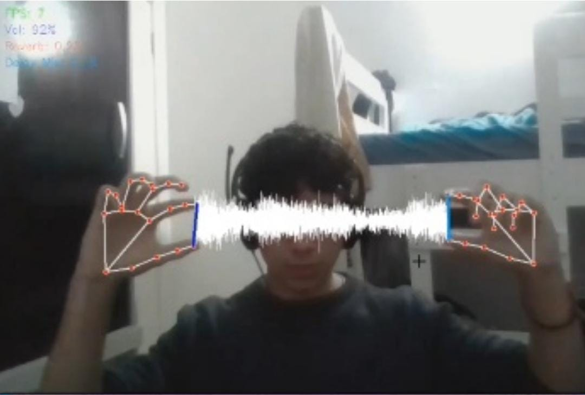

<a id="readme-top"></a>
<div align="center">
  
  [![MIT License][license-shield]][license-url]
  [![LinkedIn][linkedin-shield]][linkedin-url]
  [](https://wakatime.com/badge/user/baef9f39-b902-46fe-8782-24dcaee377e9/project/96a0dc07-5292-4aa6-ba52-eeefff3953a2)
</div>

<h4 align="center"> 
	🎧 AudioManipulatorWithComputerVision 🎥
</h4>

<p align="center">
  Projeto em Python para manipulação de áudio com filtros básicos e visão computacional.
  <br />
  <a href="https://github.com/dornelesfernando/AudioManipulatorWithComputerVision"><strong>Explore os Arquivos »</strong></a>
  <br />
  <br />
  <a href="#getting-started">Baixe e Execute</a>
  ·
  <a href="https://github.com/dornelesfernando/AudioManipulatorWithComputerVision/issues/new?template=bug-report-%F0%9F%90%9B.md">Reportar Bug</a>
  ·
  <a href="https://github.com/dornelesfernando/AudioManipulatorWithComputerVision/issues/new?template=feature-request-%E2%9C%A8.md">Sugerir Recurso</a>
</p>

> [!NOTE]
> Todo o código roda localmente. Sem site ou demo online. Veja as instruções abaixo.

---

<details>
  <summary>📚 Tabela de Conteúdos</summary>
  <ol>
    <li><a href="#sobre-o-projeto">Sobre o Projeto</a></li>
    <li><a href="#feito-com">Feito Com</a></li>
    <li><a href="#instalação">Instalação</a></li>
    <li><a href="#uso">Uso</a></li>
    <li><a href="#gestos">Uso</a></li>
    <li><a href="#roadmap">Planejamento</a></li>
    <li><a href="#licenca">Licença</a></li>
    <li><a href="#contato">Contato</a></li>
    <li><a href="#agradecimentos">Agradecimentos</a></li>
  </ol>
</details>

---

<a id="sobre-o-projeto"></a>
## ✨ Sobre o Projeto

Este projeto explora técnicas de manipulação de áudio com Python e integra conceitos de visão computacional. Ele inclui:

- Aplicação de filtros: **delay**, **reverb** e **controle de volume**
- Uso da biblioteca **sounddevice** para capturar e tocar áudio
- Opção para **baixar áudio do YouTube** e converter para `.wav`
- Foco em aprendizado sobre **DSP de áudio** e **visão computacional**

### 🎯 Objetivo

Aprender mais sobre **Python**, **processamento de sinais** e **visão computacional**, enquanto se desenvolve uma ferramenta útil para experimentações com áudio.

<p align="right">(<a href="#readme-top">voltar ao topo</a>)</p>

---

<a id="feito-com"></a>
## 🛠️ Feito Com

O projeto foi feito inteiramente com Python e as seguintes bibliotecas:

* [OpenCV (cv2)](https://pypi.org/project/opencv-python/)
* [NumPy](https://numpy.org/)
* [SoundDevice](https://pypi.org/project/sounddevice/)
* [Módulos padrão: os, time, math](https://docs.python.org/3/)

<p align="right">(<a href="#readme-top">voltar ao topo</a>)</p>

---

<a id="instalacao"></a>
## 🚀 Instalação e uso inicial

Para rodar o projeto localmente, siga os passos:

### Pré-requisitos

Tenha o **Python 3.8+** instalado. Use ambiente virtual se preferir:

```sh
python --version
```

### Instale as bibliotecas necessárias

```sh
pip install -r requirements.txt
```

Ou manualmente:

```sh
pip install opencv-python sounddevice mediapipe pycaw soundfile yt-dlp pydub pedalboard
```

### Clone o repositório

```sh
git clone https://github.com/dornelesfernando/AudioManipulatorWithComputerVision.git
cd AudioManipulatorWithComputerVision
```

### Faça download do audio

Em **downloadAudio.py** altere o link de downdload desejado e execute o arquivo

```sh
python downloadAudio.py
```

Após,
```sh
python converter_para_wav.py
```

O programa retornará "Digite o caminho completo para o arquivo de áudio que você quer converter (ex: music/Addicted.webm):", indique o nome do áudio baixado anteriormente.

Exemplo:
```sh
music/audiobaixdo.tipo
```

### Manipule o script main

Aproximadamente na linha 296, altere o caminho da música na fila para que seja possível realizar a troca de música.

Altere "music/Addicted.wav"
```sh
audio_loaded_successfully = audio_controller.load_audio("music/Addicted.wav")
```

### Execute o script main

```sh
python mainMusicHandControl.py
```

O programa retornará "Digite o caminho para o seu arquivo de áudio (ex: sua_musica.wav): ", indique o caminho do arquivo .wav baixado e aproveite.

<p align="right">(<a href="#readme-top">voltar ao topo</a>)</p>

---

<a id="uso"></a>
## 🌟 Uso

Este projeto permite:

- Aplicar **reverb**, **delay** e **controle de volume** em áudio ao vivo ou gravado.
- Baixar áudio do YouTube:

```sh
python downloadAudio.py
```

- Converter áudio para `.wav`:

```sh
python converter_para_wav.py
```

<p align="right">(<a href="#readme-top">voltar ao topo</a>)</p>

---

<a id="gestos"></a>
## 👋 Gestos

Este projeto permite:

- Com uma mão: Ajustar o volume de arcordo com a distância entre o dedo indicador e o polegar.

- Com as duas mãos: Ajustar o volume de acordo com a distância entre as mãos, ajustar o reverb e delay de acordo com distância entre o dedo indicador e o polegar das mãos.


<p align="right">(<a href="#readme-top">voltar ao topo</a>)</p>

---

<a id="images"></a>
## 📸 Imagens

**Interface de Áudio:**  



<p align="right">(<a href="#readme-top">voltar ao topo</a>)</p>

---

<a id="planejamento"></a>
## 📍 Planejamento

- [ ] Melhorar cadeia de filtros de áudio  
- [ ] Criar interface com OpenCV ou PyQT  
- [ ] Espectrograma mais interativo e com melhor resolução  
- [ ] Adicionar efeitos como flanger e eco  
- [ ] Detectar batidas ou BPM  

<p align="right">(<a href="#readme-top">voltar ao topo</a>)</p>

---

<a id="licenca"></a>
## 📝 Licença

Distribuído sob a Licença MIT. Veja o arquivo `LICENSE` para mais detalhes.

<p align="right">(<a href="#readme-top">voltar ao topo</a>)</p>

---

<a id="contato"></a>
## 🌍 Contato

**Fernando Dorneles**  
📧 fernandodorneles95@gmail.com  
🔗 [LinkedIn](https://www.linkedin.com/in/fernandodorneles) · [Lattes](http://lattes.cnpq.br/0532418852427960)  
🔗 Repositório: [GitHub](https://github.com/dornelesfernando/AudioManipulatorWithComputerVision)

<p align="right">(<a href="#readme-top">voltar ao topo</a>)</p>

---

<a id="agradecimentos"></a>
## 🤝 Agradecimentos

Aos recursos e comunidades que auxiliaram:

- [Documentação do Python](https://docs.python.org/)
- [OpenCV](https://docs.opencv.org/)
- [SoundDevice](https://python-sounddevice.readthedocs.io/)
- [Pytube](https://pytube.io/)
- [Stack Overflow](https://stackoverflow.com/)

<p align="right">(<a href="#readme-top">voltar ao topo</a>)</p>

<!-- MARKDOWN LINKS & IMAGES -->
<!-- https://www.markdownguide.org/basic-syntax/#reference-style-links -->
[license-shield]: https://img.shields.io/github/license/dornelesfernando/AgrIFFar.svg?style=for-the-badge
[license-url]: https://github.com/dornelesfernando/AgrIFFar/blob/main/LICENSE
[linkedin-shield]: https://img.shields.io/badge/-LinkedIn-black.svg?style=for-the-badge&logo=linkedin&colorB=555
[linkedin-url]: https://www.linkedin.com/in/fernandodorneles